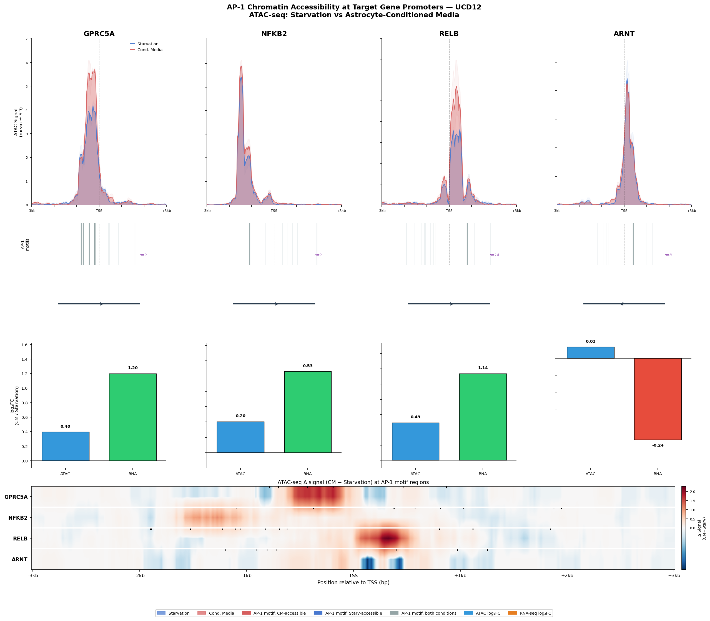

[README.md](https://github.com/user-attachments/files/25781718/README.md)
# TMAP — Transcription factor Motif Accessibility Pipeline


A computational pipeline to analyze chromatin accessibility at transcription factor binding motifs within promoter regions of target genes, using ATAC-seq data from nf-core pipeline output. Although originally developed for AP-1 (FOS::JUN) motif analysis, TMAP is fully adaptable to any transcription factor available in the JASPAR database.

## Example Output


*Example figure generated by TMAP. **Top:** Overlaid ATAC-seq signal tracks (conditioned media=red, starvation=blue, ±SD shading) across TSS ±3kb. **Second row:** AP-1 motif positions colored by chromatin accessibility status — grey marks motifs in constitutively open chromatin (accessible in both conditions), red marks motifs exclusively accessible in conditioned media (absent in this analysis), and blue marks motifs exclusively accessible in starvation (absent in this analysis). **Third row:** Gene annotation with TSS and transcription direction. **Fourth row:** log₂FC barplots showing ATAC-seq (blue) and RNA-seq (green/red) fold changes between conditions. **Bottom:** Differential accessibility heatmap (CM − Starvation) across all gene promoters, with AP-1 motif positions marked as tick marks above each gene row.*

## Biological Context

This pipeline was developed to investigate AP-1-mediated chromatin remodeling in cancer cell lines treated with conditioned media (CM) versus starvation control. The analysis focuses on four target genes identified as differentially expressed and regulated downstream of AP-1 signaling between the two conditions:

| Gene | Expected regulation | Proposed mechanism |
|------|--------------------|--------------------|
| Gene A | ↑ Upregulated | Direct AP-1 target — chromatin opens at AP-1 motifs in CM |
| Gene B | ↑ Upregulated | Direct AP-1 target — AP-1 motif accessibility increases in CM |
| Gene C | ↑ Upregulated | Indirect — alternative TF drives upregulation at non-AP-1 sites |
| Gene D | ↓ Downregulated | AP-1-facilitated repressor recruitment at accessible chromatin |

## Pipeline Overview

```
ATAC-seq BAMs (nf-core output)
        │
        ▼
[MACS2 narrow peak calling]     run_macs2_narrow.sh
        │
        ▼
[Consensus peak generation]     create_consensus_narrow_peaks.sh
        │
        ▼
[Step 1] Extract promoter regions + FASTA sequences
        │                       01_get_promoters.sh
        ▼
[Step 2] Scan AP-1 motifs (FIMO) + intersect with ATAC peaks
        │                       02_scan_ap1_motifs.sh
        ▼
[Step 3] Quantify ATAC signal at AP-1 motif sites (deepTools)
        │                       03_compute_atac_signal.py
        ▼
[Step 4] Generate publication figure
                                04_plot_tracks.py
```

## Requirements

### Software
- MACS2 (dedicated conda environment recommended — see below)
- bedtools >= 2.30
- FIMO (MEME Suite)
- deepTools >= 3.5
- Python >= 3.9

### Python packages
```bash
conda create -n ap1_atac python=3.10
conda install -c bioconda -c conda-forge \
    bedtools deeptools meme pyBigWig \
    pybedtools pandas matplotlib seaborn
```

### Separate MACS2 environment (required due to dependency conflicts)
```bash
conda create -n macs2_env python=3.9
pip install macs2
```

## Input Data

The pipeline expects nf-core ATAC-seq pipeline output with the following structure:

```
{CELL}_analysis_03-06-2025/
└── {CELL}_results_nf-core/
    └── bwa/
        └── merged_library/
            ├── bigwig/
            │   ├── CM_REP[1-3].mLb.clN.bigWig
            │   └── CONTROL_REP[1-3].mLb.clN.bigWig
            └── macs2/
                └── narrow_peak/
                    ├── {CELL}_CM_REP[1-3].mLb.clN.sorted_peaks.narrowPeak
                    └── {CELL}_CONTROL_REP[1-3].mLb.clN.sorted_peaks.narrowPeak
```

Additionally required:
- `genome.fa` — hg38 genome FASTA
- `genome.fa.sizes` — chromosome sizes file
- `hg38-blacklist.v2.bed` — ENCODE blacklist regions

## Usage

### 0. MACS2 Narrow Peak Calling
Run in `macs2_env` conda environment:
```bash
conda activate macs2_env
bash run_macs2_narrow.sh
bash create_consensus_narrow_peaks.sh
conda activate ap1_atac
```

### 1–4. Main Analysis
For each sample, change `CELL=` at the top of each script and run in order:

```bash
conda activate ap1_atac

# Change CELL="SAMPLE1" / "SAMPLE2" / "SAMPLE3" in each script

bash 01_get_promoters.sh          # Extract promoter sequences
bash 02_scan_ap1_motifs.sh        # Scan AP-1 motifs + merge peaks per condition
python3 03_compute_atac_signal.py # Quantify ATAC signal at motif sites
python3 04_plot_tracks.py         # Generate publication figure
```

## Gene Coordinates (hg38, MANE Select)

Coordinates for genes of interest should be verified from UCSC Genome Browser GENCODE V49 MANE Select transcripts and updated in `01_get_promoters.sh`. Example format:

| Gene | Chr | TSS | Strand |
|------|-----|-----|--------|
| Gene A | chrN | XXXXXXXXX | + |
| Gene B | chrN | XXXXXXXXX | + |
| Gene C | chrN | XXXXXXXXX | + |
| Gene D | chrN | XXXXXXXXX | − |

## AP-1 Motifs Used

| Motif ID | Name | Width | Source |
|----------|------|-------|--------|
| MA0099.3 | FOS::JUN | 11 bp | JASPAR 2024 |
| MA0476.1 | FOS::JUND | 10 bp | JASPAR 2024 |

FIMO scanning threshold: p < 1×10⁻³

## Output Files

For each sample (`{CELL}` = SAMPLE1, SAMPLE2, ...):

```
Plot_AP-1_sites/{CELL}_AP-1/
├── motifs/
│   ├── AP1_FOSJUN.meme                     # Motif database
│   ├── fimo_output/fimo.tsv                # Raw FIMO results
│   ├── AP1_motif_sites.bed                 # All AP-1 motif positions
│   ├── AP1_motifs_in_CM_peaks.bed          # Motifs in CM-accessible chromatin
│   └── AP1_motifs_in_CONTROL_peaks.bed     # Motifs in CTRL-accessible chromatin
├── results/
│   ├── promoter_windows_2000bp.bed         # Promoter windows (TSS ± 2kb)
│   ├── promoter_sequences.fa               # FASTA sequences for FIMO
│   └── signal_quantification/
│       └── AP1_signal_summary_{CELL}.tsv   # ATAC signal log2FC per gene
└── figures/
    ├── AP1_figure_{CELL}_v2.pdf            # Publication figure (PDF)
    └── AP1_figure_{CELL}_v2.png            # Publication figure (PNG)
```

## Figure Description

Each sample figure contains:
1. **ATAC-seq tracks** — Overlaid CM (red) and Starvation (blue) mean signal ± SD across TSS ± 3kb window
2. **AP-1 motif panel** — Motif positions colored by chromatin accessibility (red = CM-accessible, blue = Starvation-accessible, grey = both conditions)
3. **Gene annotation** — TSS position and transcription direction
4. **Bar plots** — ATAC-seq log₂FC and RNA-seq log₂FC (CM vs Starvation) side by side
5. **Heatmap** — Differential ATAC signal (CM − Starvation) across all gene promoters, with AP-1 motif positions marked

## Key Findings

This pipeline enables identification of:
- Genes with AP-1 motifs co-localizing with increased chromatin accessibility in CM — consistent with direct AP-1-mediated transcriptional activation
- Genes where chromatin changes do not co-localize with AP-1 motifs — suggesting indirect regulation through alternative transcription factors
- Genes showing transcriptional repression despite accessible chromatin — consistent with AP-1-facilitated recruitment of transcriptional repressors

## Customization — Using a Different Transcription Factor

This pipeline can be adapted to analyze chromatin accessibility at binding motifs of **any transcription factor** available in JASPAR. Follow these steps:

### 1. Find your motif in JASPAR
Go to [https://jaspar.elixir.no](https://jaspar.elixir.no) and search for your TF of interest. Note the **motif ID** (e.g., `MA0139.1` for CTCF) and **motif name**.

### 2. Update the motif database in `02_scan_ap1_motifs.sh`
Replace the MEME-format motif block with your TF's matrix. You can download it directly from JASPAR in MEME format:
```bash
# Download any motif from JASPAR in MEME format
wget -O my_TF_motif.meme \
  "https://jaspar.elixir.no/api/v1/matrix/MA0139.1/?format=meme"
```
Then update the script to point to your motif file:
```bash
MOTIF_DB="${ANALYSIS_DIR}/motifs/my_TF_motif.meme"
```

### 3. Update gene coordinates in `01_get_promoters.sh`
Replace the four genes with your genes of interest. Look up TSS coordinates in UCSC Genome Browser (GENCODE V49, MANE Select transcripts):
```bash
cat > "$OUTDIR/genes_of_interest.bed" << 'EOF'
chr1    100000    100001    GENE1    .    +
chr2    200000    200001    GENE2    .    -
EOF
```

### 4. Update chromosome map in `03_compute_atac_signal.py`
Match your gene names to their chromosomes:
```python
chrom_map = {
    "GENE1": "chr1",
    "GENE2": "chr2",
}
```

### 5. Update gene metadata in `04_plot_tracks.py`
Add TSS coordinates, strand and window size for each gene:
```python
GENES = {
    "GENE1": {"chr": "chr1", "tss": 100000, "strand": "+", "window": 3000},
    "GENE2": {"chr": "chr2", "tss": 200000, "strand": "-", "window": 3000},
}
```

### 6. Update RNA-seq log2FC values in `04_plot_tracks.py`
Add your own RNA-seq fold change values, or set to `None` if unavailable:
```python
RNA_LOG2FC = {
    "SAMPLE1": {"GENE1": 1.5, "GENE2": -0.8},
    "SAMPLE2": {"GENE1": None, "GENE2": None},  # No RNA-seq
}
```

### Tips
- The pipeline works with **any number of genes** — just add/remove entries consistently across all four scripts
- For broader motif scanning, lower the FIMO threshold in `02_scan_ap1_motifs.sh`: `--thresh 1e-2`
- For stricter scanning, raise the threshold: `--thresh 1e-4`
- The promoter window (`WINDOW=2000` in `01_get_promoters.sh`) can be increased to capture distal regulatory elements

## Citation

If you use this pipeline, please cite:
- MAME Suite / FIMO: Grant et al., Bioinformatics (2011)
- deepTools: Ramírez et al., Nucleic Acids Research (2016)
- bedtools: Quinlan & Hall, Bioinformatics (2010)
- JASPAR 2024: Castro-Mondragon et al., Nucleic Acids Research (2022)
- nf-core/atacseq: Ewels et al., Nature Biotechnology (2020)

## Author

Developed for the analysis of AP-1-mediated chromatin remodeling in cancer cells across experimental conditions.  
Ricaurte Alejandro Marquez-Ortiz — [your institution]  
March 2026
